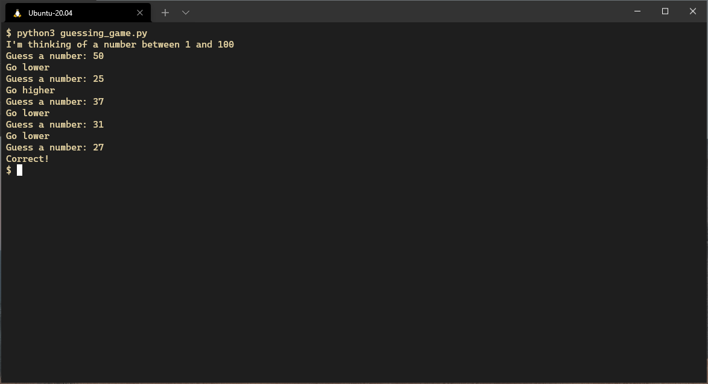

# Basic control flow

In this section we'll go into basic control flow in Python
introducing if statements, loops and functions.

## `if` statements

`if` statements in Python are written using a simple syntax
with the body of the code being executed
indented by four spaces.

``` python
if condition:
    do_a_thing()
    do_another_thing()
elif other_condition:
    do_something_else()
else:
    do_this_instead()
```

The body of a condition will be executed if the condition is truthy.
Expressions are "truthy" if they
* are boolean expressions that evaluate to True
  * 4 < 5
  * len("something") == 8
  * True and not False
* represent any non-zero number
  ``` python
  if 5:
      print("5 is truthy")
  ```
* represent non-empty containers
  ``` python
  if "something":
      # this will be executed
  if []:
      # this won't be
  ```
* are not None
  ``` python
  if None:
      # Won't ever be executed
  ```

### Ternary expressions

If the result of an if statement was to assign a value due to a condition
you can condense it into a ternary expression.

This block
``` python
if condition:
    a = value_1
else:
    a = value_2
```

is equivalent to this one-liner
``` python
a = value_1 if condition else value_2
```

## Loops

Python has two loop structures,
the `for` loop which iterates
over all elements in a sequence

``` python
for letter in "RESPECT":
    print(letter)
print("Find out what it means to me!")
```

and the `while` loop,
which loops while a condition is true.

``` python
bottles = 99
while bottles:
    print(f"{bottles} bottles of beer on the wall")
    print(f"{bottles} bottles of beer")
    print("take one down")
    print("pass it around")
    bottles -= 1
    print(f"{bottles} bottles of beer on the wall")
```

## Functions

Functions are a way to pass control to another piece of code
for a computation or other effect
and optionally return a result back to the caller.
Functions are declared in Python using the `def` keyword,
then defining the name of the function and its arguments.

Functions are invaluable for organising code,
providing both separation and reusability.

The following function takes an integer and doubles it.

``` python
def double(input: int) -> int:
    return input * 2
```

Python has a number of built-in functions worth taking a look at.
You can read more about them in the
[official documentation](https://docs.python.org/3/library/functions.html).

## Exercise: Guess the number

Using what you've learned so far,
write a program which picks a number between 1 and 100,
then asks for user input and lets you know
if the number was higher or lower then what you entered
before looping and asking you to guess again.



### Hints

The `random.randint()` function from the standard library
returns a random integer between a provided min and max value.

You can use it by adding `import random` to the top of your program.

```
>>> import random
>>> random.randint(1, 10)
9
```

To compare the string the user entered by the number guessed by Python
you'll have to cast the number to an `int` first.
You can do this by using the built in `int` function.

```
>>> "4" > 5
Traceback (most recent call last):
  File "<stdin>", line 1, in <module>
TypeError: '>' not supported between instances of 'str' and 'int'
>>> int("4") > 5
False
```